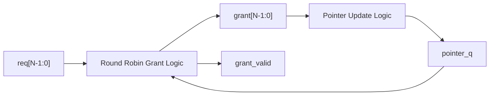
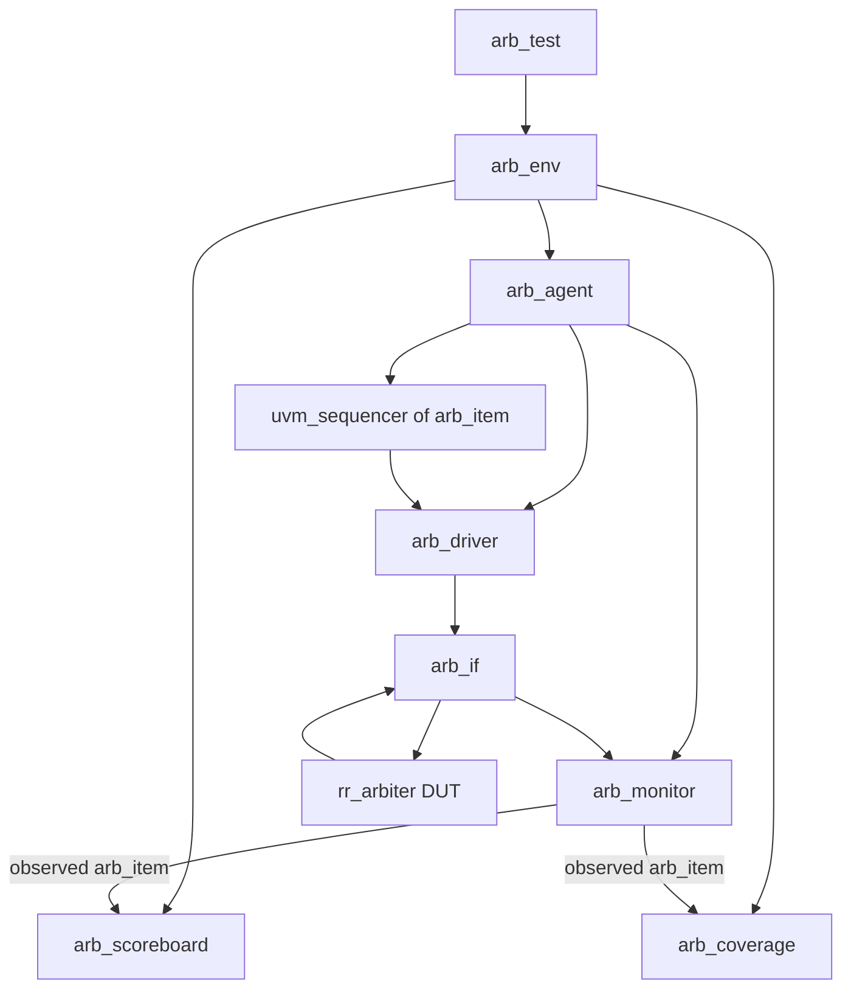

# Round Robin Arbiter with SystemVerilog and UVM Verification

[](#)
[](#)
[](#)
[](#)

This project implements and verifies a **parameterized Round Robin Arbiter** using **SystemVerilog RTL** and a complete **UVM 1.2 verification environment**.

The arbiter receives multiple request signals and grants access to one requester at a time using a rotating priority pointer. The design ensures fair access among requesters by updating the pointer after every successful grant.

This project is intended to demonstrate proficiency in:

* SystemVerilog RTL design
* Parameterized hardware design
* Round-robin arbitration logic
* One-hot grant generation
* Assertion-based protocol checking
* UVM testbench architecture
* Directed and constrained-random verification
* Scoreboard-based checking
* Functional coverage
* EPWave waveform debugging

---

## Table of Contents

* [Project Overview](#project-overview)
* [Repository Files](#repository-files)
* [What is a Round Robin Arbiter?](#what-is-a-round-robin-arbiter)
* [Design Features](#design-features)
* [RTL Architecture](#rtl-architecture)
* [DUT Interface](#dut-interface)
* [Arbitration Algorithm](#arbitration-algorithm)
* [Pointer Update Logic](#pointer-update-logic)
* [Grant Encoding](#grant-encoding)
* [SystemVerilog Assertions](#systemverilog-assertions)
* [Verification Architecture](#verification-architecture)
* [UVM Component Breakdown](#uvm-component-breakdown)
* [Stimulus Strategy](#stimulus-strategy)
* [Scoreboard Reference Model](#scoreboard-reference-model)
* [Functional Coverage](#functional-coverage)
* [Waveform Debugging](#waveform-debugging)
* [How to Run on EDA Playground](#how-to-run-on-eda-playground)
* [Expected Simulation Result](#expected-simulation-result)
* [How to Read the Waveform](#how-to-read-the-waveform)
* [Known Scope and Limitations](#known-scope-and-limitations)
* [Future Improvements](#future-improvements)
* [License](#license)

---

## Project Overview

A round robin arbiter is commonly used in digital systems where multiple requesters compete for access to one shared resource.

Examples include:

* Bus arbitration
* Memory controller request scheduling
* Network-on-chip routers
* DMA channel selection
* Shared peripheral access
* Multi-master SoC interconnects

This project implements a simple **4-requester round robin arbiter** by default, while keeping the RTL parameterized so the number of requesters can be changed using the `N` parameter.

The design is verified using a complete UVM environment that includes:

* UVM transaction
* Directed sequence
* Constrained-random sequence
* Driver
* Monitor
* Agent
* Scoreboard
* Functional coverage
* Environment
* Test
* Top-level testbench
* VCD waveform dump for EPWave

---

## Repository Files

| File           | Description                                                                 |
| -------------- | --------------------------------------------------------------------------- |
| `design.sv`    | Contains the parameterized round robin arbiter RTL.                         |
| `testbench.sv` | Contains the complete UVM verification environment and top-level testbench. |
| `README.md`    | Project documentation.                                                      |

Recommended EDA Playground setup:

| Setting        | Value             |
| -------------- | ----------------- |
| Language       | SystemVerilog     |
| Methodology    | UVM 1.2           |
| Simulator      | Aldec Riviera-PRO |
| Design file    | `design.sv`       |
| Testbench file | `testbench.sv`    |

---

## What is a Round Robin Arbiter?

An arbiter decides which requester gets access to a shared resource.

A **fixed-priority arbiter** always checks requesters in the same priority order. For example, requester 0 may always have the highest priority. This is simple, but it can cause starvation if high-priority requesters are always active.

A **round robin arbiter** avoids this by rotating priority after every successful grant.

For a 4-requester arbiter:

```text
Requester IDs: 0, 1, 2, 3
```

If requester 0 is granted, the next search starts from requester 1.

If requester 1 is granted, the next search starts from requester 2.

If requester 3 is granted, the pointer wraps back to requester 0.

This makes the arbiter fairer than a fixed-priority arbiter.

---

## Design Features

The RTL supports the following features:

| Feature                       | Description                                                 |
| ----------------------------- | ----------------------------------------------------------- |
| Parameterized requester count | Number of requesters controlled by `N`.                     |
| One-hot grant output          | Only one requester is granted at a time.                    |
| Grant-valid output            | Indicates whether the grant output is valid.                |
| Rotating priority pointer     | Fair round-robin arbitration.                               |
| No grant during idle          | If no request is active, grant is zero.                     |
| Pointer update after grant    | Pointer moves to the requester after the granted requester. |
| Wrap-around priority          | After requester `N-1`, priority returns to requester `0`.   |
| Assertion checks              | Protocol correctness checked using SVA.                     |
| UVM verification              | Complete reusable UVM environment.                          |

---

## RTL Architecture

The top-level DUT is:

```systemverilog
module rr_arbiter #(
    parameter int N = 4
)(
    input  logic         clk,
    input  logic         rst_n,

    input  logic [N-1:0] req,
    output logic [N-1:0] grant,
    output logic         grant_valid
);
```

The arbiter contains two main logic blocks:

1. **Combinational grant generation**
2. **Sequential pointer update**



---

## DUT Interface

| Signal        | Direction | Width | Description                        |
| ------------- | --------: | ----: | ---------------------------------- |
| `clk`         |     Input |     1 | Main clock.                        |
| `rst_n`       |     Input |     1 | Active-low reset.                  |
| `req`         |     Input |   `N` | Request vector from requesters.    |
| `grant`       |    Output |   `N` | One-hot grant vector.              |
| `grant_valid` |    Output |     1 | High when a valid grant is issued. |

For the default 4-requester configuration:

```systemverilog
req[3:0]
grant[3:0]
```

---

## Arbitration Algorithm

The arbiter checks the request bits starting from the current pointer value.

For `N = 4`, the priority order depends on `pointer_q`.

| `pointer_q` | Priority Order |
| ----------: | -------------- |
|         `0` | 0 → 1 → 2 → 3  |
|         `1` | 1 → 2 → 3 → 0  |
|         `2` | 2 → 3 → 0 → 1  |
|         `3` | 3 → 0 → 1 → 2  |

The first active request found in that rotating priority order receives the grant.

Example:

```text
pointer_q = 2
req       = 4'b1011
```

Active requesters:

```text
requester 0 = active
requester 1 = active
requester 2 = inactive
requester 3 = active
```

Priority order from pointer 2:

```text
2 → 3 → 0 → 1
```

Requester 2 is inactive, so the arbiter checks requester 3 next. Since requester 3 is active:

```text
grant = 4'b1000
```

---

## Pointer Update Logic

The pointer updates only when a valid grant occurs.

If requester `i` is granted:

```text
pointer_q = i + 1
```

If requester `N-1` is granted:

```text
pointer_q = 0
```

This creates the round-robin rotation.

Example for `N = 4`:

| Current Grant | Granted Requester | Next Pointer |
| ------------: | ----------------: | -----------: |
|     `4'b0001` |                 0 |            1 |
|     `4'b0010` |                 1 |            2 |
|     `4'b0100` |                 2 |            3 |
|     `4'b1000` |                 3 |            0 |

---

## Grant Encoding

The `grant` signal is one-hot encoded.

For the default 4-requester arbiter:

| Hex | Binary | Meaning             |
| --: | -----: | ------------------- |
| `0` | `0000` | No grant            |
| `1` | `0001` | Requester 0 granted |
| `2` | `0010` | Requester 1 granted |
| `4` | `0100` | Requester 2 granted |
| `8` | `1000` | Requester 3 granted |

Only one bit of `grant` should be high when `grant_valid = 1`.

---

## SystemVerilog Assertions

The testbench interface contains protocol assertions to catch illegal arbiter behavior.

### 1. One-hot grant assertion

When `grant_valid` is high, `grant` must be one-hot.

```systemverilog
property p_grant_onehot;
    @(posedge clk) disable iff (!rst_n)
    grant_valid |-> $onehot(grant);
endproperty
```

This prevents invalid grant values such as:

```text
grant = 4'b0011
grant = 4'b1010
grant = 4'b1111
```

---

### 2. Grant must match active request

The arbiter must not grant a requester that did not request service.

```systemverilog
property p_grant_requested;
    @(posedge clk) disable iff (!rst_n)
    grant_valid |-> ((grant & req) == grant);
endproperty
```

Example illegal case:

```text
req   = 4'b0010
grant = 4'b1000
```

Requester 3 was granted even though only requester 1 was active.

---

### 3. No request means no grant

If no request is active, no grant should be produced.

```systemverilog
property p_no_request_no_grant;
    @(posedge clk) disable iff (!rst_n)
    (req == '0) |-> (!grant_valid && grant == '0);
endproperty
```

Correct behavior:

```text
req         = 4'b0000
grant       = 4'b0000
grant_valid = 1'b0
```

---

## Verification Architecture

The verification environment follows a standard UVM architecture.



The verification flow is:

1. `arb_test` creates the environment.
2. `arb_env` creates the agent, scoreboard, and coverage collector.
3. The agent contains sequencer, driver, and monitor.
4. The driver applies request patterns to the DUT.
5. The monitor observes request/grant behavior.
6. The scoreboard checks the DUT output against a reference round-robin model.
7. The coverage collector samples functional coverage.
8. The test reports scoreboard and coverage status.

---

## UVM Component Breakdown

| Component          | Type                    | Purpose                                                                             |
| ------------------ | ----------------------- | ----------------------------------------------------------------------------------- |
| `arb_if`           | SystemVerilog interface | Groups DUT signals and contains clocking blocks and assertions.                     |
| `arb_item`         | `uvm_sequence_item`     | Represents one arbiter transaction: request, grant, grant-valid, and cycle count.   |
| `arb_directed_seq` | `uvm_sequence`          | Sends deterministic request patterns to test edge cases and pointer rotation.       |
| `arb_random_seq`   | `uvm_sequence`          | Sends constrained-random request patterns.                                          |
| `arb_driver`       | `uvm_driver`            | Drives `req` into the DUT.                                                          |
| `arb_monitor`      | `uvm_monitor`           | Samples `req`, `grant`, and `grant_valid`.                                          |
| `arb_agent`        | `uvm_agent`             | Contains sequencer, driver, and monitor.                                            |
| `arb_scoreboard`   | `uvm_subscriber`        | Predicts expected grant behavior and compares with DUT output.                      |
| `arb_coverage`     | `uvm_subscriber`        | Collects functional coverage.                                                       |
| `arb_env`          | `uvm_env`               | Connects agent, scoreboard, and coverage.                                           |
| `arb_test`         | `uvm_test`              | Runs directed tests followed by constrained-random tests.                           |
| `testbench_top`    | SV module               | Instantiates DUT/interface, generates clock/reset, starts UVM, and dumps waveforms. |

---

## Stimulus Strategy

The testbench uses two types of stimulus:

1. Directed stimulus
2. Constrained-random stimulus

---

### Directed Stimulus

The directed sequence tests important request patterns.

| Request Pattern | Meaning                       |
| --------------- | ----------------------------- |
| `4'b0000`       | No requester active           |
| `4'b0001`       | Only requester 0 active       |
| `4'b0010`       | Only requester 1 active       |
| `4'b0100`       | Only requester 2 active       |
| `4'b1000`       | Only requester 3 active       |
| `4'b0011`       | Requesters 0 and 1 active     |
| `4'b0101`       | Requesters 0 and 2 active     |
| `4'b1001`       | Requesters 0 and 3 active     |
| `4'b0110`       | Requesters 1 and 2 active     |
| `4'b1010`       | Requesters 1 and 3 active     |
| `4'b1100`       | Requesters 2 and 3 active     |
| `4'b0111`       | Requesters 0, 1, and 2 active |
| `4'b1011`       | Requesters 0, 1, and 3 active |
| `4'b1101`       | Requesters 0, 2, and 3 active |
| `4'b1110`       | Requesters 1, 2, and 3 active |
| `4'b1111`       | All requesters active         |

The sequence also repeats selected request patterns to check pointer rotation and fairness.

Examples:

```systemverilog
repeat (8) begin
    send_req(4'b1111, "all_requesters_active");
end
```

This checks that grants rotate when all requesters are continuously active.

Expected grant rotation:

```text
0001 → 0010 → 0100 → 1000 → 0001
```

---

### Constrained-Random Stimulus

The random sequence generates randomized request vectors.

The transaction constraint biases generation toward active requests while still allowing idle cycles:

```systemverilog
constraint c_req_distribution {
    req dist {
        4'b0000           := 5,
        [4'b0001:4'b1111] := 95
    };
}
```

This means:

* Idle request cycles are still tested.
* Active request cycles are more frequent.
* Random combinations stress the pointer and grant logic.

Default random sequence length:

```systemverilog
random_seq.n = 300;
```

---

## Scoreboard Reference Model

The scoreboard contains an independent reference model of the expected round-robin behavior.

It maintains its own reference pointer:

```systemverilog
int unsigned pointer_ref;
```

For every monitored transaction, the scoreboard:

1. Reads the request vector.
2. Searches for the first active requester starting from `pointer_ref`.
3. Generates the expected one-hot grant.
4. Compares expected grant with actual DUT grant.
5. Compares expected grant-valid with actual DUT grant-valid.
6. Updates `pointer_ref` after a successful expected grant.

Reference-model logic:

```systemverilog
for (int offset = 0; offset < `ARB_N; offset++) begin
    int unsigned idx;
    idx = (pointer_ref + offset) % `ARB_N;

    if (!expected_valid && t.req[idx]) begin
        expected_grant[idx] = 1'b1;
        expected_valid      = 1'b1;
        expected_idx        = idx;
    end
end
```

Pointer update:

```systemverilog
if (expected_valid) begin
    pointer_ref = (expected_idx + 1) % `ARB_N;
end
```

The scoreboard also checks:

* Grant must be one-hot.
* Grant must match an active request.
* Grant and `grant_valid` must match the reference model.

---

## Functional Coverage

The coverage model checks whether important arbiter scenarios were exercised.

Coverage is collected in `arb_coverage`.

### Covered Items

| Coverpoint                | Purpose                                                                            |
| ------------------------- | ---------------------------------------------------------------------------------- |
| `cp_req_pattern`          | Covers idle, single-request, two-request, three-request, and all-request patterns. |
| `cp_req_count`            | Covers number of active requests: 0, 1, 2, 3, and 4.                               |
| `cp_grant_valid`          | Covers both no-grant and valid-grant cycles.                                       |
| `cp_grant_pattern`        | Covers no grant and each one-hot grant.                                            |
| `cp_grant_index`          | Covers each granted requester index.                                               |
| `x_req_count_grant_valid` | Crosses request count with grant-valid behavior.                                   |
| `x_req_count_grant_index` | Crosses number of active requesters with grant index.                              |

### Coverage Target

The default target is:

```text
90% functional coverage
```

At the end of simulation, the testbench prints a coverage summary:

```text
COVERAGE SUMMARY: arbiter_functional_coverage=<value>% target=90.00%
```

If the target is reached, the log prints:

```text
Coverage target reached
```

---

## Waveform Debugging

The testbench generates a VCD file:

```systemverilog
$dumpfile("dump.vcd");
```

The following signals are dumped:

```systemverilog
$dumpvars(0, testbench_top.clk);
$dumpvars(0, testbench_top.vif.rst_n);
$dumpvars(0, testbench_top.vif.req);
$dumpvars(0, testbench_top.vif.grant);
$dumpvars(0, testbench_top.vif.grant_valid);
$dumpvars(0, testbench_top.dut.pointer_q);
```

Recommended EPWave signal order:

| Signal           | Recommended Radix          |
| ---------------- | -------------------------- |
| `clk`            | Binary                     |
| `rst_n`          | Binary                     |
| `req[3:0]`       | Binary                     |
| `grant[3:0]`     | Binary                     |
| `grant_valid`    | Binary                     |
| `pointer_q[1:0]` | Unsigned decimal or binary |

For a portfolio screenshot, binary radix is recommended for `req` and `grant` because it clearly shows one-hot behavior.

---

## How to Run on EDA Playground

### 1. Create files

Create two files:

```text
design.sv
testbench.sv
```

Place the arbiter RTL in `design.sv`.

Place the UVM testbench in `testbench.sv`.

---

### 2. Select simulator

Recommended EDA Playground settings:

| Setting     | Value                   |
| ----------- | ----------------------- |
| Language    | SystemVerilog           |
| Methodology | UVM 1.2                 |
| Simulator   | Aldec Riviera-PRO       |
| Run mode    | Batch or EPWave-enabled |

---

### 3. Compile and run command

Use:

```bash
vlib work && vlog '-timescale' '1ns/1ns' +incdir+$RIVIERA_HOME/vlib/uvm-1.2/src -l uvm_1_2 design.sv testbench.sv && vsim -c -do "vsim +access+r +UVM_TESTNAME=arb_test +UVM_VERBOSITY=UVM_MEDIUM +UVM_NO_RELNOTES; run -all; exit"
```

Correct UVM test name:

```text
arb_test
```

---

## Expected Simulation Result

A successful run should show:

```text
Running test arb_test...
Round Robin Arbiter UVM test started
Starting directed round-robin arbiter sequence
Starting constrained-random sequence with 300 transactions
Round Robin Arbiter UVM test completed
SCOREBOARD PASS: all checked cycles matched expected round-robin behavior
COVERAGE SUMMARY: arbiter_functional_coverage=<value>% target=90.00%
Coverage target reached
UVM_ERROR : 0
UVM_FATAL : 0
```

A passing scoreboard means:

* The DUT grant matched the reference model.
* The pointer behavior was correct.
* No grant was issued for inactive requesters.
* No invalid multi-bit grant occurred.

---

## How to Read the Waveform

A typical waveform includes:

```text
clk
pointer_q[1:0]
grant[3:0]
grant_valid
req[3:0]
rst_n
```

### Example 1: Single requester

```text
req   = 4'b0100
grant = 4'b0100
```

Only requester 2 is active, so requester 2 is granted.

---

### Example 2: Multiple requesters

```text
pointer_q = 2
req       = 4'b1011
```

Priority order:

```text
2 → 3 → 0 → 1
```

Requester 2 is inactive. Requester 3 is active.

Expected grant:

```text
grant = 4'b1000
```

---

### Example 3: All requesters active

```text
req = 4'b1111
```

Expected grant sequence over repeated cycles:

```text
0001 → 0010 → 0100 → 1000 → 0001
```

This demonstrates fairness.

---

### Example 4: No request

```text
req = 4'b0000
```

Expected output:

```text
grant       = 4'b0000
grant_valid = 1'b0
```

---

## Why This Project Demonstrates Proficiency

This project is intentionally simple, but it covers important verification concepts.

It demonstrates:

* Clean parameterized RTL design
* Correct use of `always_comb`
* Correct use of `always_ff`
* Rotating priority logic
* One-hot grant protocol
* Active-low reset handling
* Interface-based testbench connection
* Clocking blocks
* Assertions
* UVM sequence item modeling
* Directed sequence creation
* Constrained-random stimulus
* Driver implementation
* Monitor implementation
* Agent architecture
* Analysis ports
* Scoreboard reference modeling
* Functional coverage collection
* Coverage target reporting
* EPWave waveform debugging

This makes it a strong beginner-to-intermediate UVM portfolio project.

---

## Known Scope and Limitations

This implementation supports:

* Round-robin arbitration
* Parameterized requester count
* One-hot grant output
* Grant-valid signaling
* Single-cycle combinational grant generation
* Registered pointer update
* UVM verification
* Functional coverage
* Assertions

This implementation does not include:

* Request locking
* Parking grant
* Weighted round-robin arbitration
* Ready/acknowledge handshake
* Multi-cycle grant hold
* Backpressure
* AXI/AHB/APB bus integration
* QoS priority levels
* Starvation counters
* Formal proof

---

## Future Improvements

Possible extensions:

1. Add `ready` or `ack` handshake.
2. Add grant-hold until requester drops request.
3. Add weighted round-robin support.
4. Add fixed-priority mode and compare it against round-robin mode.
5. Add parameterized coverage for arbitrary `N`.
6. Add formal verification properties.
7. Add starvation-freedom assertions.
8. Add APB or AXI-Lite wrapper.
9. Add regression scripts.
10. Add CI support using open-source tools where possible.

---

## License

```text
MIT License
```
```text
This project is released under the MIT License.
```

---

## Author Notes

This project is suitable for showcasing SystemVerilog and UVM fundamentals in a digital design and verification portfolio.

It is intentionally compact, readable, and EDA Playground friendly, while still demonstrating the full verification flow expected from a practical UVM project.
